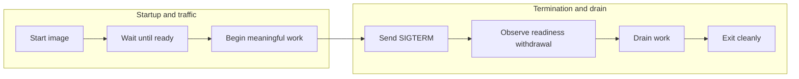

<p align="center">
  
</p>

<h1 align="center">Draincheck</h1>

<p align="center">
  <strong>Test graceful container shutdown before production does.</strong>
</p>

<p align="center">
  Draincheck is a provider-neutral CLI that exercises the complete lifecycle of a built container
  image inside CI: startup, readiness, in-flight work, termination, draining, and clean exit.
</p>

<p align="center">
  <a href="https://github.com/ssubedir/draincheck/actions/workflows/ci.yml"></a>
  <a href="https://ssubedir.github.io/draincheck/"></a>
  <a href="https://github.com/ssubedir/draincheck/releases"></a>
  <a href="LICENSE"></a>
</p>

---

Your application can pass unit tests, respond to health checks, and still lose work during a
deployment. Draincheck tests the final image through the same termination boundary it will face in
production—without installing an agent, modifying the image, or contacting a hosted service.

<div align="center">



</div>

Draincheck exits non-zero when the lifecycle contract fails, making it suitable for pull-request,
release, and deployment pipelines using Docker or Podman.

## Quick start

Install the CLI with Go, or download a Linux archive from
[GitHub Releases](https://github.com/ssubedir/draincheck/releases/latest):

```bash
go install github.com/ssubedir/draincheck/cmd/draincheck@latest
draincheck version
```

Generate a documented starter contract:

```bash
draincheck init --image checkout:local --port 8080
```

The essential shape is intentionally small:

```yaml
version: 1

target:
  image: checkout:local
  container_port: 8080

readiness:
  driver: http
  path: /ready
  success_status: 200
  startup_timeout: 10s
  interval: 100ms

traffic:
  driver: http
  request:
    method: GET
    path: /work?delay=2s
  count: 5
  concurrency: 5
  shutdown_after: 250ms
  request_timeout: 5s

shutdown:
  signal: SIGTERM
  deadline: 10s

assertions:
  readiness_withdrawn_within: 2s
  inflight_requests_complete: true
  max_failed_requests: 0
  exit_code: 0
  forbid_force_kill: true
```

Adapt `/ready` and `/work` to safe, application-owned behavior, then test the exact image your
pipeline may publish:

```bash
docker build -t checkout:local .
draincheck validate --config draincheck.yaml
draincheck verify checkout:local \
  --config draincheck.yaml \
  --report-json reports/draincheck.json \
  --report-junit reports/draincheck.xml \
  --debug-bundle reports/draincheck-debug.zip
```

Docker is preferred in `--runtime=auto` mode; Podman is used when Docker is unavailable. Select one
explicitly with `--runtime docker` or `--runtime podman`.

## Put it in CI

Run Draincheck after building the image and before publishing or deploying it. Pin the Draincheck
version in automation and retain its reports even when the lifecycle assertion fails.

```yaml
steps:
  - uses: actions/checkout@v6

  - uses: actions/setup-go@v7
    with:
      go-version: "1.25.x"

  - name: Install Draincheck
    run: go install github.com/ssubedir/draincheck/cmd/draincheck@v0.2.0

  - name: Build application image
    run: docker build -t "checkout:${{ github.sha }}" .

  - name: Verify container lifecycle
    run: |
      mkdir -p reports
      draincheck verify "checkout:${{ github.sha }}" \
        --config draincheck.yaml \
        --runtime docker \
        --report-json reports/draincheck.json \
        --report-junit reports/draincheck.xml \
        --debug-bundle reports/draincheck-debug.zip \
        --no-color

  - name: Upload lifecycle evidence
    if: always()
    uses: actions/upload-artifact@v7
    with:
      name: draincheck-evidence
      path: reports/
```

Start with a non-blocking pilot. Promote the step to a required release gate once the service owner
agrees the scenario exercises meaningful, safe work. The
[pilot guide](documentation/content/docs/pilot-guide.md) also includes GitHub Actions and GitLab CI
examples.

## What Draincheck verifies

Every run creates a fresh, isolated container and checks that:

1. The application becomes ready before its startup deadline.
2. Configured work is genuinely active when the runtime confirms signal delivery.
3. Readiness is withdrawn within the declared budget.
4. In-flight work completes according to the selected protocol contract.
5. Optional post-signal, streaming, and telemetry-flush expectations are satisfied.
6. The container exits with the expected code before the shutdown deadline.
7. The process was not OOM-killed and did not require forced cleanup.

Draincheck labels every run, publishes random ports only on `127.0.0.1`, bounds captured output,
and removes the exact container it created. `--keep-on-failure` is available for intentional local
debugging.

## Lifecycle adapters

The starter contract uses HTTP, while optional adapters cover richer application boundaries:

| Boundary | Supported adapters |
|---|---|
| Readiness | HTTP, standard gRPC Health, or an in-container exec command |
| In-flight work | HTTP, unary gRPC, or an application-owned host command |
| New work after signal | Require the service to accept or reject new requests |
| Long-lived work | SSE, receive-only WebSocket, and server-streaming gRPC |
| Telemetry shutdown flush | Correlated OpenTelemetry traces and metrics over OTLP/HTTP |
| Lifecycle model | Generic termination or a Kubernetes-style pre-stop profile |
| Repeated coverage | Repeated fresh-container runs with optional p95 budgets |
| Scenario coverage | Multiple YAML contracts against the same built image |

Readiness, workload, and streaming probes may use separate container ports. HTTP requests support
headers, inline or file-backed bodies, and exact success statuses. gRPC supports reflection or a
descriptor set, protobuf JSON requests, metadata, and expected status codes.

See the [configuration reference](documentation/content/docs/configuration.md) for every field and
default.

## Reports and exit codes

Draincheck produces human-readable console output plus automation-friendly evidence:

- JSON for stable machine-readable lifecycle results.
- JUnit XML for CI test and pull-request interfaces.
- A bounded debug ZIP containing the resolved configuration, event timeline, assertions, final
  runtime state, and container logs.

Request bodies are excluded from reports. Header values, command environment values, and
secret-like container environment variables are redacted from debug evidence.

| Exit code | Meaning |
|---:|---|
| `0` | Every lifecycle assertion passed. |
| `1` | The run completed, but one or more assertions failed. |
| `2` | The command or configuration was invalid. |
| `3` | A runtime, reporting, cleanup, or internal error prevented a valid verdict. |
| `130` | Draincheck was interrupted and attempted cleanup. |

The [troubleshooting guide](documentation/content/docs/troubleshooting.md) maps each failed
assertion to the most useful evidence.

## Commands

| Command | Purpose |
|---|---|
| `draincheck init` | Write a complete, commented starter contract. |
| `draincheck validate` | Strictly validate YAML without starting a container. |
| `draincheck verify` | Execute one container lifecycle scenario. |
| `draincheck repeat` | Repeat a scenario and summarize timing evidence. |
| `draincheck suite` | Run multiple scenarios against one image. |
| `draincheck schema` | Print the versioned configuration JSON Schema. |
| `draincheck version` | Print version and build metadata. |

Run `draincheck <command> --help` for flags and examples.

## Current support boundary

Draincheck v0.2 supports Linux container images through a local Docker Engine 28.0+ or Podman 4.9+
runtime. Static release archives are published for Linux `amd64` and `arm64`.

Docker Desktop, Podman Machine, source builds on Windows or macOS, and emulated image architectures
are best-effort paths. Native Windows containers, generic remote daemons, live-cluster execution,
built-in HTTPS/custom-CA handling, and TLS-protected gRPC are outside the current boundary.

Read the [support and stability contract](documentation/content/docs/support.md) for precise runtime,
protocol, configuration, report, and compatibility guarantees.

## Documentation

- [Getting started](documentation/content/docs/getting-started.mdx)
- [Configuration reference](documentation/content/docs/configuration.md)
- [Readiness verification](documentation/content/docs/readiness.md)
- [HTTP traffic](documentation/content/docs/http-traffic.md)
- [gRPC lifecycle verification](documentation/content/docs/grpc.md)
- [Command traffic probes](documentation/content/docs/command-probes.md)
- [Streaming connections](documentation/content/docs/streaming.md)
- [OpenTelemetry shutdown flush](documentation/content/docs/telemetry.md)
- [Repeated runs](documentation/content/docs/repeat.md) and
  [scenario suites](documentation/content/docs/suite.md)
- [Troubleshooting](documentation/content/docs/troubleshooting.md)

## Development

Run the same quality gate used by CI:

```bash
make check
```

Run lifecycle conformance against either supported runtime:

```bash
make e2e
make e2e RUNTIME=podman
```

Exercise the release-style fixture and report path:

```bash
make dogfood
make dogfood RUNTIME=podman
```

Tool dependencies are pinned in `go.mod`; no global linter installation is required. See
[CONTRIBUTING.md](CONTRIBUTING.md) for development setup and lifecycle-test expectations. Release
maintainers can use the [release runbook](.github/RELEASING.md).

## Security

Report suspected vulnerabilities through the private process in [SECURITY.md](SECURITY.md). Do not
include credentials, private configuration, proprietary logs, or vulnerability details in public
issues or pilot feedback.

## License

Draincheck is licensed under the [Apache License 2.0](LICENSE).
